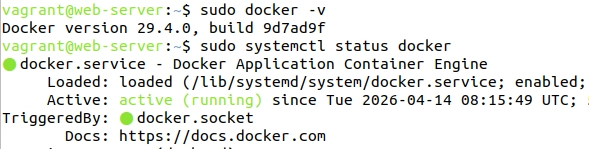
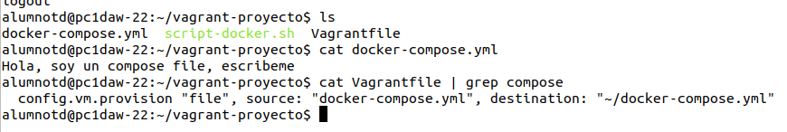
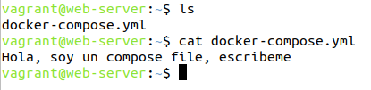

Para crear un Vagrantfile escribe en una carpeta dedicada el comando `vagrant init ubuntu/jammy64`.

Tambien crear un script que instale docker con el comando `touch script-docker.sh`. Dentro de este copiar y pegar los [comandos de instalación de docker engine](https://docs.docker.com/engine/install/ubuntu/):

```bash
#!/bin/bash
#sustituye apt por apt-get para mejor compatibilidad
#añadir -y para automaticamente instalar todo (si no da error)
apt-get update -y
apt-get install -y ca-certificates curl
install -m 0755 -d /etc/apt/keyrings
curl -fsSL https://download.docker.com/linux/ubuntu/gpg -o /etc/apt/keyrings/docker.asc
chmod a+r /etc/apt/keyrings/docker.asc

tee /etc/apt/sources.list.d/docker.sources <<EOF
Types: deb
URIs: https://download.docker.com/linux/ubuntu
Suites: $(. /etc/os-release && echo "${UBUNTU_CODENAME:-$VERSION_CODENAME}")
Components: stable
Architectures: $(dpkg --print-architecture)
Signed-By: /etc/apt/keyrings/docker.asc
EOF

apt-get update -y
apt-get install -y docker-ce docker-ce-cli containerd.io docker-buildx-plugin docker-compose-plugin 
```

Después, edita el Vagrant file para provisionar el script al correr `vagrant up` por primera vez,  enlazar el puerto 8080 del host con el puerto 80 del guest, y de más configuraciones (a gusto personal).

```
Vagrant.configure("2") do |config|
  config.vm.box = "ubuntu/jammy64"
  config.vm.hostname = "web-server"

  config.vm.network "forwarded_port", guest: 80, host: 8080, auto_correct: true

  config.vm.provider "virtualbox" do |vb|
	vb.name = "Web Server PHP"
   end

  config.vm.provision "shell", path: "script-docker.sh"
end
```

Una vez configurado podremos arrancar la maquina virtual con vagrant up e instalará docker, docker-compose-plugin y dependencias necesarias recomendadas.

Entra con `vagrant ssh` a la máquina para asegurar que docker está instalado:




## Como Añadir un archivo externo dentro de la maquina virtual

```
  config.vm.provision "file", source: "docker-compose.yml", destination: "~/docker-compose.yml"
```




